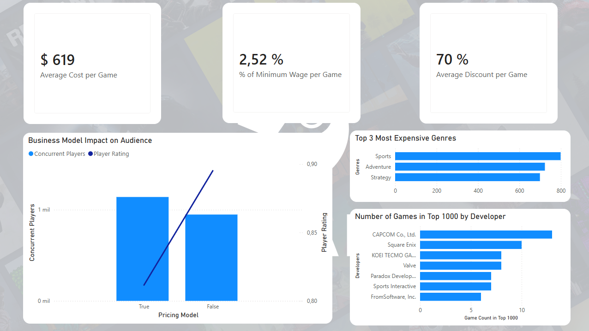
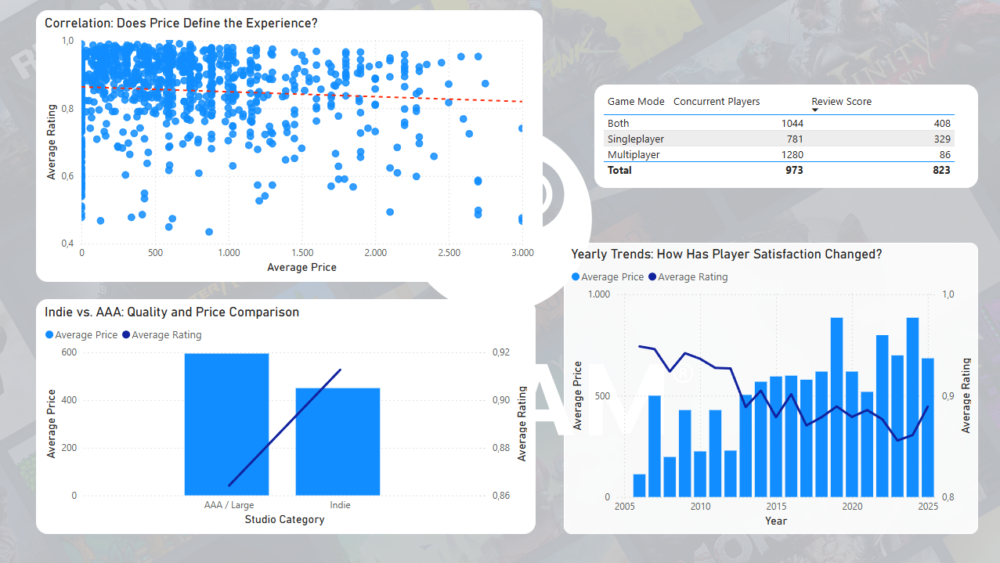
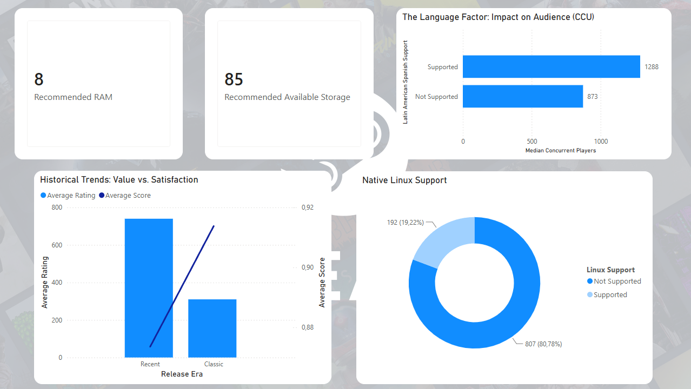

# Steam Uruguay — Gaming Market Accessibility Analysis

A data analysis project exploring the Top 1,000 most-played Steam games through the lens of the Uruguayan market. Unlike most Steam datasets, this project collects live data via API, including real-time prices in Uruguayan pesos (UYU), rather than relying on pre-packaged Kaggle CSVs.


---

## Context

Uruguay has its own regional Steam pricing in Uruguayan pesos (UYU), making it one of the few Latin American countries with fully localized pricing. This project analyzes what those prices actually mean relative to local purchasing power: *how accessible is PC gaming for a Uruguayan consumer earning the national minimum wage?*

---

## Dataset

| | |
|---|---|
| **Sources** | SteamSpy API (popularity ranking) + Steam Store API (live prices, metadata) |
| **Scope** | Top 1,000 games by Concurrent Users (CCU) as of June 2026 |
| **Price currency** | Uruguayan Peso (UYU) via `cc=uy` parameter |
| **Final rows** | ~1000 games (some titles unavailable via API) |
| **File** | `steam_games_uy.csv` |

### Key columns

| Column | Description |
|--------|-------------|
| `appid` | Steam application ID |
| `name` | Game title |
| `ccu` | Concurrent users at time of collection |
| `price_uyu` | Current price in Uruguayan pesos |
| `original_price_uyu` | Price before discount |
| `discount_pct` | Active discount percentage |
| `review_score` | Positive reviews / total reviews (0–1) |
| `metacritic_score` | Metacritic score (where available) |
| `genres` | Comma-separated genre tags |
| `has_es_latam` | Latin American Spanish support |
| `is_indie` | Classified as Indie genre |
| `is_multiplayer` | Multiplayer category flag |
| `is_singleplayer` | Singleplayer category flag |
| `is_free` | Free-to-play title |
| `era` | Release era: Recent / Modern / Established / Classic |
| `ram_gb` | Minimum RAM requirement (GB) |
| `storage_gb` | Minimum storage requirement (GB) |
| `pct_min_wage` | Price as % of Uruguayan minimum wage (UYU 24,572) |

---

## Key Findings

1. **Median game price: 619 UYU**, roughly 2.5% of the monthly minimum wage
2. **14.6% of top games are free-to-play** (146 out of 999)
3. **Price negatively correlates with review score (r = -0.29)**, cheaper games tend to be better received
4. **Indie games outperform AAA** in review score (0.913 vs 0.865) at a lower average price
5. **Only 28.4% of top games support Latin American Spanish**, yet those games attract 47% more concurrent players (1,288 vs 873 median CCU)
6. **Sports is the most expensive genre**, driven by FIFA and NBA 2K titles
7. **When discounts happen, they're aggressive**, median discount of 70% (only 16.5% of games are currently discounted)
8. **Classic games (10+ years old) cost less and score higher** than recent releases (310 vs 721 UYU; 0.915 vs 0.872 review score)
9. **To run 90% of the top 1,000 games: 8 GB RAM and 85 GB storage**
10. **Only 19.2% of games natively support Linux** (192 out of 999) relevant for Steam Deck users
11. **Multiplayer games have higher CCU** (1,068 vs 947 median) but singleplayer titles score higher on reviews

---

## Dashboard

The Power BI dashboard contains three pages:

### Page 1 — Accessibility & Prices
- Average price, % of minimum wage, average discount (KPI cards)
- Business model impact: free vs. paid CCU and review score comparison
- Top 3 most expensive genres
- Top developers by number of games in the Top 1,000

  

### Page 2 — Quality & Market
- Price vs. review score scatter plot (correlation)
- Indie vs. AAA: price and review score comparison
- Game mode breakdown: Both / Singleplayer / Multiplayer (CCU and review score)
- Yearly trends: average price and player satisfaction over time

  

### Page 3 — Accessibility Factors
- Recommended RAM and storage hardware targets (KPI cards, P90)
- Latin American Spanish support impact on audience size
- Native Linux support (donut chart)
- Historical value: Recent vs. Classic era price and review score

  

---

## Project Structure

```
steam-uruguay/
├── data/
│   └── steam_games_uy.csv         # Final cleaned dataset
├── steam_pipeline.py              # Full pipeline: collection → cleaning → derived columns → analysis summary
├── steam_uruguay.pbix             # Power BI dashboard (3 pages)
└── README.md
```

---

## How to Run

### Requirements

```bash
pip install requests pandas
```

### Full pipeline (first run)

```bash
python steam_pipeline.py
```

> ⚠️ Estimated runtime: ~35 minutes due to SteamSpy pagination and Steam API rate limits.

The script will:
1. Download the full SteamSpy catalog (~86,000 games across ~87 pages)
2. Filter the Top 1,000 by CCU
3. Fetch live data from the Steam Store API with Uruguayan pricing (`cc=uy`)
4. Clean and enrich the dataset with derived columns
5. Export `steam_games_uy.csv`
6. Print an analysis summary to the console

---

## Technical Notes

- Prices are fetched with `cc=uy` (Uruguay country code), returning real UYU prices as listed on Steam for Uruguayan users
- Review score is computed as `positive / (positive + negative)`, equivalent to Steam's own rating system
- Minimum wage reference: **UYU 24,572** (Uruguay, 2026)
- Games with `price_uyu = 0` and `is_free = False` are titles no longer available on the store (removed, region-locked, or access-limited)
- RAM and storage requirements are extracted via regex from the raw HTML of Steam's `pc_requirements` field
- Hardware percentiles (P90) exclude null values, as not all games provide structured requirement data

---

## Author

**Franco Cossatti** — Junior Data Analyst

[LinkedIn](https://www.linkedin.com/in/franco-cossatti)
